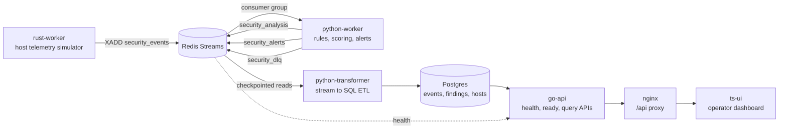
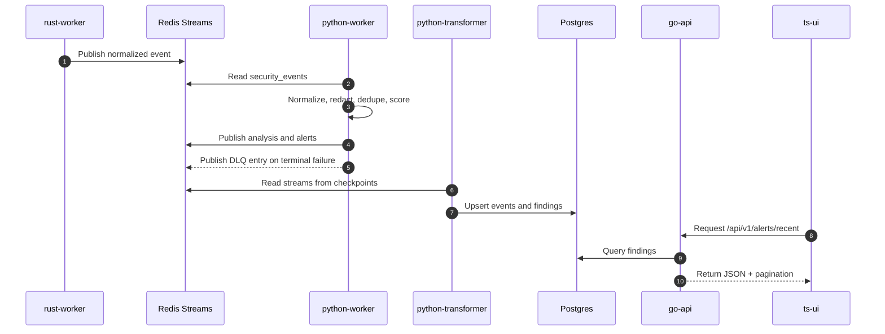
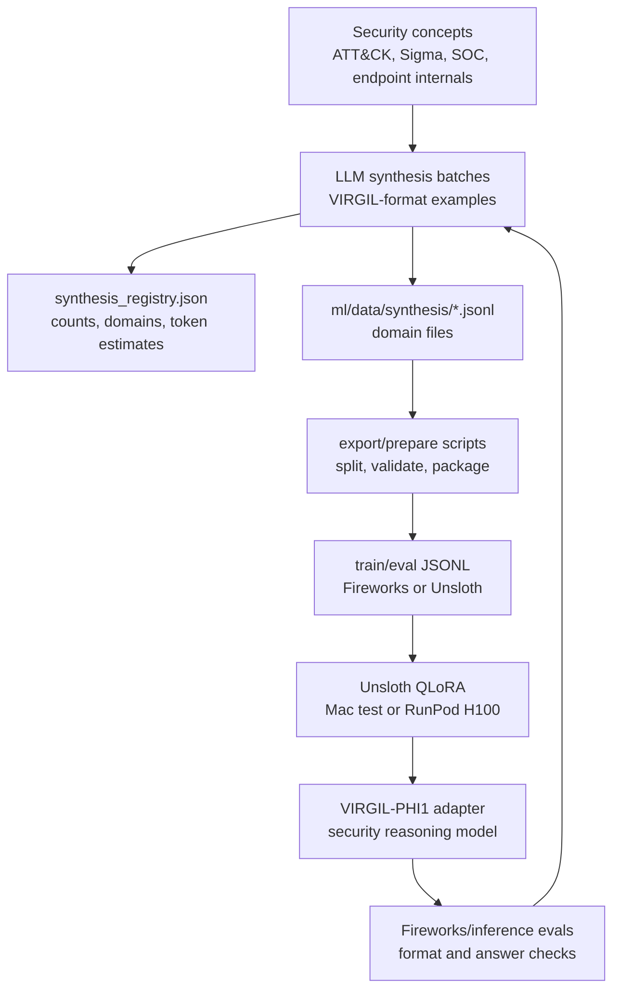

# VIRGIL

**Vendor Independent Response Governance Intelligence Layer**

VIRGIL is an open endpoint-security platform starter and ML training workspace
for detection, investigation, and response. It pairs a runnable polyglot
security pipeline with a growing synthetic training corpus for **VIRGIL
Advisor**, a security-reasoning assistant designed to help analysts map
telemetry to behavior, explain evidence, and recommend response actions.

The current repository is intentionally practical: it boots locally with Docker
Compose, exposes real query APIs, includes a small operator dashboard, and ships
model-training assets that can be used immediately for SFT experiments.

## Why VIRGIL

Most security projects split the runtime and the model work into separate
worlds. VIRGIL keeps them close:

- A concrete endpoint telemetry pipeline you can run, test, and extend.
- A clean Postgres-backed data model for events, findings, hosts, and agent
  heartbeats.
- Redis Streams for transport, retry, and DLQ workflows.
- A dedicated ML package with **~2.13M tokens** of original synthetic security
  reasoning data for training and evaluating VIRGIL Advisor.
- Training scripts and configs for local Mac testing and RunPod/H100 QLoRA
  fine-tuning.

## Project Goals

VIRGIL is being built toward four practical goals:

- **Runnable security infrastructure:** keep the stack easy to boot, inspect,
  test, and extend on a local machine.
- **Vendor-independent response logic:** model events, detections, findings,
  and response workflows without binding the core design to one EDR, SIEM, or
  LLM provider.
- **Training-grade security data:** maintain a clean, useful corpus for people
  who want to train small and medium models on endpoint investigation,
  detection engineering, and structured security reasoning.
- **Human-centered automation:** use agents and models to accelerate triage and
  evidence review while preserving explicit contracts, logs, and operator
  approval boundaries.

## Current State

VIRGIL is in a Phase 0/Phase 1 baseline as of May 2026. The repo is small on
purpose, but the core path is real: events flow through Redis, get scored by a
Python worker, land in Postgres, and are visible through Go APIs and the static
dashboard.

| Area | Implemented now | Next focus |
|---|---|---|
| Runtime pipeline | Rust event simulator, Redis Streams, Python rules worker, Postgres ETL, Go API, nginx UI | Harden transformer checkpoint resume and idempotency |
| Operations | `make doctor`, `make test`, `make verify`, Docker Compose, DLQ replay utility | Add CI gates for doctor, tests, and compose smoke verification |
| API | Health/readiness, agent check-in/status, recent alerts, event search, query validation and pagination metadata | Expand alert workflow, fleet inventory, and detection intelligence |
| UI | Health, recent alerts, and event search panels using same-origin `/api/*` | Build operator workflows around triage, event detail, and findings |
| ML | 2,008 synthetic records, ~2.13M synthetic tokens, train/eval snapshots, Unsloth configs | Grow toward the 10M-token VIRGIL-PHI1 target and integrate model inference |

## Architecture



VIRGIL keeps Redis as the transport layer and Postgres as the authoritative
long-term store. The Python worker performs the current runtime analysis using
heuristics and scoring; the ML package is the training track that will become
the Advisor model layer.

## What Is In This Repo

| Path | Purpose |
|---|---|
| `go-api/` | HTTP edge for health, readiness, agent status, recent alerts, and event search. |
| `python-worker/` | Rules worker, scoring helpers, Redis ingestion, DLQ publishing, and transformer ETL job. |
| `rust-worker/` | Async Tokio simulator that publishes normalized security events to Redis Streams. |
| `rust-host-agent/` | Early host-agent package boundary for future native collection work. |
| `ts-ui/` | Static operator dashboard served by nginx with `/api/*` proxying to the Go API. |
| `db/migrations/` | Postgres schema for hosts, events, findings, heartbeats, and ETL checkpoints. |
| `scripts/` | Bootstrap, stack verification, and safe DLQ replay tooling. |
| `docs/` | API/data model notes, event contract, deployment notes, and next-build plan. |
| `ml/` | VIRGIL Advisor synthetic corpus, dataset docs, Fireworks export/eval tooling, and training scripts. |

## Quick Start

```bash
# Creates .env from .env.example if needed and injects a one-time 256-bit
# local Postgres password. Existing .env files are left unchanged.
make bootstrap
docker compose up --build -d
make verify
```

Local URLs:

| Service | URL |
|---|---|
| Operator dashboard | `http://localhost:3000` |
| Go API health | `http://localhost:8080/health` |
| UI proxied API health | `http://localhost:3000/api/health` |
| Postgres | `localhost:5432` |
| Redis | `localhost:6379` |

If the default ports are occupied, adjust the host bindings in
`docker-compose.yml`.

## Developer Commands

```bash
make doctor   # Show local toolchain and Docker availability
make test     # Run Go, Rust, and Python tests; missing toolchains are skipped
make up       # Build and start the full stack
make down     # Stop the stack, preserving named volumes
make logs     # Tail service logs
make verify   # Smoke-test API and UI proxy health after the stack is up
```

The current host test suite covers Go API behavior, Rust event-shape helpers,
and Python worker/observability/DLQ basics.

## API Surface

| Endpoint | Description |
|---|---|
| `GET /health` | Health check for Redis and Postgres. |
| `GET /ready` | Readiness check using the same dependency probes. |
| `POST /api/v1/agents/checkin` | Upsert host and latest agent heartbeat. |
| `GET /api/v1/agents/{agent_id}/status` | Return the latest status for one agent. |
| `GET /api/v1/alerts/recent?limit=20&offset=0` | Read recent findings with pagination metadata. |
| `GET /api/v1/events/search?host_id=&event_type=&severity=&limit=50&offset=0` | Search persisted events with validated filters. |

Query guardrails:

- `alerts/recent`: `limit` must be `1..100`; `offset` must be `0..10000`.
- `events/search`: `limit` must be `1..250`; `offset` must be `0..10000`.
- `events/search` severity must be one of `low`, `medium`, `high`, or
  `critical`.
- Invalid query params return `400` with `error_code`, `message`, and optional
  `details`.

## Data Flow



The worker redacts obvious sensitive command content before logging or
publishing derived analysis. Avoid adding raw payload logging unless the data is
explicitly safe.

## VIRGIL Advisor ML

The `ml/` package is the model-training side of the project. It is built around
OpenAI-compatible `messages` JSONL and explicit structured-answer contracts so
fine-tuned models can be evaluated and eventually wired into the runtime
pipeline.

A companion write-up on the training run is available on Arthur Kaiser's blog:
[One Night, Two Million Tokens, and a Custom Cybersecurity Model](https://www.artkaiser.net/blog/custom-cybersecurity-models-fireworks).

VIRGIL Advisor examples teach the model to:

- Map observed activity to MITRE ATT&CK techniques.
- Explain why telemetry is suspicious or benign.
- Read Sigma-style detection logic and identify covered behavior.
- Recommend telemetry, containment, and investigation next steps.
- Perform multi-hypothesis reasoning over endpoint and SOC timelines.
- Preserve a structured answer that downstream code can parse.

### Corpus Snapshot

| Metric | Current value |
|---|---:|
| Synthesis registry version | `0.3-synthesis` |
| Synthetic source records | 2,008 |
| Synthetic source token estimate | 2,129,858 |
| Synthesis domain files | 13 |
| Current Fireworks SFT export | 1,900 train / 100 eval examples |
| Current deterministic baseline snapshot | 13,689 train / 1,964 eval examples |
| Archived v0.2 train/eval snapshot | 13,731 / 1,974 examples |

The headline 2M-token corpus is tracked in `ml/synthesis_registry.json` and
lives under `ml/data/synthesis/`. The Fireworks/OpenAI-compatible export lives
under `ml/data/fireworks/`. The checked-in `ml/data/final/` and
`ml/training/data/` files are deterministic baseline snapshots used by the
current Unsloth configs unless you update `dataset_path` to point at a newer
synthetic export.

The current Fireworks manifest exports 2,000 source records into a 1,900/100
train/eval split. The registry includes an additional small
`web_framework_security` file that can be included the next time the export is
refreshed.

The ML tree intentionally excludes PDFs, parser chunks, and raw extracted book
text. The checked-in corpus is original synthetic training material.

The dataset is useful beyond this repo. It can serve as:

- SFT data for a cybersecurity assistant that must answer in a structured
  contract.
- Evaluation fixtures for ATT&CK mapping, SOC reasoning, and telemetry
  recommendation.
- Seed material for distilling larger teacher-model behavior into smaller
  local or hosted models.
- A reference format for building defensive security datasets without shipping
  copyrighted source text or raw sensitive telemetry.

### Record Contract

Each training example is a chat record with system, user, and assistant
messages. Source records keep provenance in a top-level `meta` object; Fireworks
exports strip that metadata from each row and preserve split/source details in
`ml/data/fireworks/manifest.json`. Assistant responses use a two-part contract:

```json
{
  "messages": [
    {"role": "system", "content": "You are VIRGIL-Advisor..."},
    {"role": "user", "content": "Investigate this endpoint scenario..."},
    {
      "role": "assistant",
      "content": "<reasoning>Evidence-based analysis...</reasoning>\n<answer>{\"severity\":\"high\"}</answer>"
    }
  ],
  "meta": {
    "task": "hypothesis_testing",
    "split": "train",
    "synthesized": true
  }
}
```

The `<reasoning>` section teaches investigation discipline. The `<answer>`
section is structured JSON intended for automated parsing and evaluation.

### ML Training Loop



### Training Quick Start

Inspect the corpus:

```bash
cd ml
cat synthesis_registry.json
```

Export the synthetic corpus to Fireworks/OpenAI-compatible SFT files:

```bash
cd ml
python scripts/export_fireworks_sft.py \
  --input-dir data/synthesis \
  --output-dir data/fireworks \
  --eval-ratio 0.05

python scripts/validate_fireworks_sft.py \
  data/fireworks/virgil_fireworks_train.jsonl \
  data/fireworks/virgil_fireworks_eval.jsonl
```

Run Unsloth training against the checked-in training snapshot:

```bash
# Production-style cloud run
cd ml/training
python scripts/train_virgil_phi1.py --config configs/virgil_phi1_h100.yaml

# Local 24GB Mac test run
python scripts/train_virgil_phi1.py --config configs/virgil_phi1_mac.yaml --force-mac
```

The current target model is `microsoft/phi-4` using Unsloth QLoRA. The JSONL
format is also suitable for other SFT stacks that accept chat-template
`messages` datasets. To train the Unsloth path on the synthetic export, update
the config `dataset_path` to point at
`../data/fireworks/virgil_fireworks_train.jsonl`.

## Operations Notes

### DLQ Replay

Use the replay tool to inspect and safely requeue failed worker messages from
`security_dlq`.

```bash
# Dry run, no writes
python3 scripts/replay_dlq.py --limit 50

# Requeue messages
python3 scripts/replay_dlq.py --execute --limit 50

# Requeue and delete successfully replayed DLQ entries
python3 scripts/replay_dlq.py --execute --delete-replayed --limit 50
```

Useful flags:

- `--from-id <stream-id>` resumes from a specific DLQ stream ID.
- `--target-stream <name>` forces the destination stream.
- `--fallback-stream <name>` is used when the DLQ source stream is missing or
  invalid.

### Secrets

Do not commit `.env`. It is gitignored and should contain local Postgres
credentials, `DATABASE_URL`, `REDIS_URL`, and any API keys. `make bootstrap`
refuses to write `.env` if git would track it, then creates it once from
`.env.example` with a generated 256-bit local Postgres password. Existing
`.env` files are never overwritten. Keep `.env.example` placeholder-only.

`DATABASE_URL` must match the Postgres credentials in `.env`. If the local
Postgres volume was initialized with old credentials, rotate the password inside
Postgres or reset the development volume with:

```bash
docker compose down -v
docker compose up --build -d
```

That reset is destructive and should only be used for local development data.

## Roadmap

The next build order is deliberately backend-first:

1. **Transformer safety (`ART-14`)**
   Harden checkpoint resume, idempotency, and partial batch failure behavior in
   `python-worker/transform_job.py`.
2. **CI baseline (`ART-15`)**
   Add workflow gates for `make doctor`, `make test`, and compose smoke
   verification.
3. **Product surface expansion**
   Build richer alert detail, investigation workflows, fleet inventory, and
   model-assisted triage after the runtime baseline is safer.
4. **VIRGIL-PHI1 growth**
   Scale the corpus toward the 10M-token goal, improve eval coverage, train
   adapters, and define the runtime integration boundary for Advisor inference.

Detailed milestone tracking lives in `docs/next-build-plan.md`.

## License

MIT License. See `LICENSE`.
