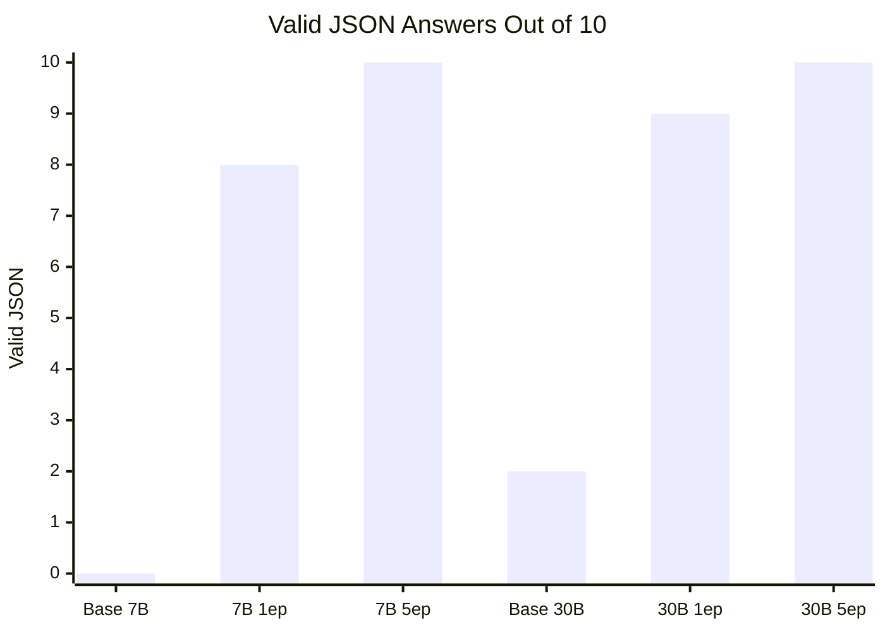
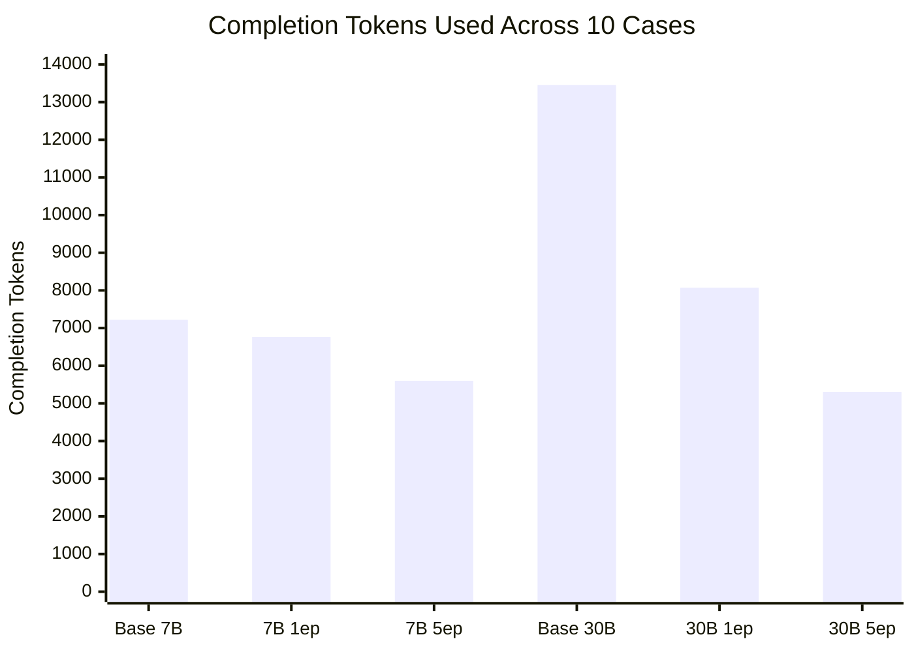
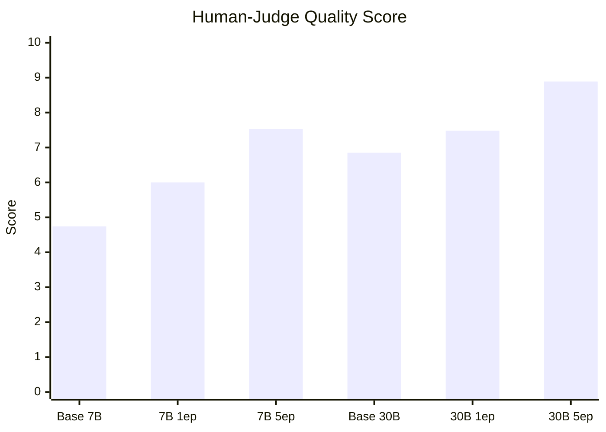

# VIRGIL Fine-Tune Value Report

Date: 2026-05-17
Platform: Fireworks.ai
Eval: same 10 held-out VIRGIL prompts for all successful models
Sampling: `temperature=0`, `max_tokens=2200`, same eval file SHA256 for every run
Dataset: ~2M tokens of highly curated, SME-approved cybersecurity data built with LLMs and human reviewers

## The Short Version

Fine-tuning worked.

The base models often understood the cybersecurity problem, especially the 30B model, but they did not reliably produce the required VIRGIL response contract:

```text
<reasoning>...</reasoning>
<answer>{valid JSON}</answer>
```

The fine-tuned models learned that contract hard. The best run, Qwen3 30B A3B 5ep, produced valid structured answers on 10/10 cases, won 9/10 judged cases, used fewer completion tokens than its base model, and responded faster in this eval.

## Same Prompt Set

All successful runs used the exact same 10 held-out prompts:

```text
virgil_fireworks_eval.jsonl:23:30da2b075a2f8e2f
virgil_fireworks_eval.jsonl:38:a515ec8c71a6399c
virgil_fireworks_eval.jsonl:39:fdaf3878148e3985
virgil_fireworks_eval.jsonl:47:8a9f729dd9b07cd6
virgil_fireworks_eval.jsonl:54:014b84ee8fb1dc92
virgil_fireworks_eval.jsonl:67:1387895a7f0718b8
virgil_fireworks_eval.jsonl:70:f6ae20b2aaba45b0
virgil_fireworks_eval.jsonl:85:38d0bc8d5d82adbb
virgil_fireworks_eval.jsonl:91:b029c048bed38ba2
virgil_fireworks_eval.jsonl:99:0988ab4ddbc06a7b
```

## Structural Compliance

This is where the fine-tune paid for itself.

| Model | Type | Valid JSON | Valid Answer Tags | Avg Latency | Completion Tokens |
|---|---|---:|---:|---:|---:|
| Base Qwen2 7B | Base | 0/10 | 2/10 | 7.98s | 7,218 |
| Qwen2 7B 1ep | Fine-tuned | 8/10 | 9/10 | 7.37s | 6,760 |
| Qwen2 7B 5ep | Fine-tuned | **10/10** | **10/10** | 6.20s | 5,601 |
| Base Qwen3 30B A3B | Base | 2/10 | 10/10 | 6.42s | 13,457 |
| Qwen3 30B A3B 1ep | Fine-tuned | 9/10 | 9/10 | 5.55s | 8,071 |
| Qwen3 30B A3B 5ep | Fine-tuned | **10/10** | **10/10** | **3.84s** | **5,306** |

### JSON Reliability



### Completion Token Discipline



## Human-Judge Scores

| Model | Avg Score | Read |
|---|---:|---|
| Base Qwen2 7B | 4.74 | Gets the rough story, breaks contract constantly |
| Qwen2 7B 1ep | 6.00 | Better structure, not fully stable |
| Qwen2 7B 5ep | 7.53 | Strong value model |
| Base Qwen3 30B A3B | 6.85 | Smart but messy and non-compliant |
| Qwen3 30B A3B 1ep | 7.48 | High ceiling, one bad runaway |
| Qwen3 30B A3B 5ep | **8.89** | Best overall |



## What Changed After Fine-Tuning?

### Qwen2 7B

Base Qwen2 could reason in broad strokes, but it did not understand that the answer had to be machine-readable JSON. It frequently wrote prose inside `<answer>` or forgot to close the tag.

After 5 epochs:

- valid JSON improved from 0/10 to 10/10
- completion tokens dropped from 7,218 to 5,601
- average score rose from 4.74 to 7.53
- answers became more directly SOC-operational

That is a very real fine-tune gain.

### Qwen3 30B A3B

Base Qwen3 30B was already knowledgeable. On some prompts it gave strong security analysis, but it was verbose, sometimes over-mapped ATT&CK, and failed valid JSON on 8 of 10 cases.

After 5 epochs:

- valid JSON improved from 2/10 to 10/10
- completion tokens dropped from 13,457 to 5,306
- average latency dropped from 6.42s to 3.84s
- average score rose from 6.85 to 8.89
- it won 9 of 10 judged cases

That is the big result. The fine-tune did not merely add facts; it shaped the base model into a disciplined endpoint investigator.

## DeepSeek 8B Note

DeepSeek R1 Distill Qwen3 8B could be trained, but Fireworks deployment failed internally for:

- the fine-tuned adapter deployment
- the base model minimal-shape deployment
- the base model direct H100 deployment

No useful inference comparison was possible for that model tonight.

## Case-Level Observations

### The Easy Win: JSON Contract

The base models generally understood `<reasoning>` because the system prompt told them to. The fine-tune taught the harder behavior: put concise, valid, structured JSON inside `<answer>`.

For downstream use, this matters more than style. A SOC automation pipeline can parse valid JSON; it cannot reliably parse almost-JSON prose.

### The Big Quality Win: Missing Benign Evidence

The best fine-tuned outputs repeatedly asked the right defensive question:

> What evidence would have to exist for this to be benign, and why is it missing?

That behavior is the heart of VIRGIL. It showed up most clearly in:

- malicious npm package on a macOS developer workstation
- section-backed in-memory DLL patching
- `regini` registry permission tampering
- remote unsigned DLL loading via `rundll32`

### The Best Technical Differentiator

The Linux journal recovery case separated the models sharply.

The 30B 5ep model correctly identified that archived `.journal` files can be read with `journalctl --file`, and that `remote/` indicates journal forwarding/remote logging context. The 7B fine-tune and base Qwen2 both gave weaker or misleading interpretations.

## Cost/Value Read

Qwen2 7B 5ep is the budget workhorse. It is good enough to keep testing when inference cost matters.

Qwen3 30B A3B 5ep is the quality target. It is the first model in this run that feels like a credible VIRGIL endpoint investigator.

The practical strategy:

1. Use Qwen3 30B 5ep as the quality benchmark.
2. Use Qwen2 7B 5ep as the low-cost baseline.
3. Expand evals to 50-100 held-out cases before deciding whether the extra 30B inference spend is justified.

## Artifact Index

| Artifact | Path |
|---|---|
| Fine-tuned human judgment | `data/fireworks/inference_evals/fireworks_inference_eval_20260517T060509Z_human_judgment.json` |
| Base-vs-fine-tuned judgment | `data/fireworks/inference_evals/fireworks_base_vs_finetuned_judgment_20260517.json` |
| Fine-tuned combined outputs | `data/fireworks/inference_evals/fireworks_inference_eval_20260517T060509Z_combined_judge_pairs.jsonl` |
| Base Qwen2/Qwen3 outputs | `data/fireworks/inference_evals/fireworks_inference_eval_20260517T062121Z.jsonl` |
| Base Qwen2/Qwen3 summary | `data/fireworks/inference_evals/fireworks_inference_eval_20260517T062121Z_summary.json` |
| Eval runner | `scripts/run_fireworks_inference_eval.py` |

## Bottom Line

The fine-tune turned capable general models into much more useful VIRGIL models.

The biggest gains were:

- structured JSON compliance
- concise answer discipline
- lower output-token usage
- stronger hypothesis elimination
- better defender actionability

For the next paid run, Qwen3 30B A3B 5ep deserves a larger 50-case eval. Qwen2 7B 5ep deserves continued testing as the cheap inference option.
