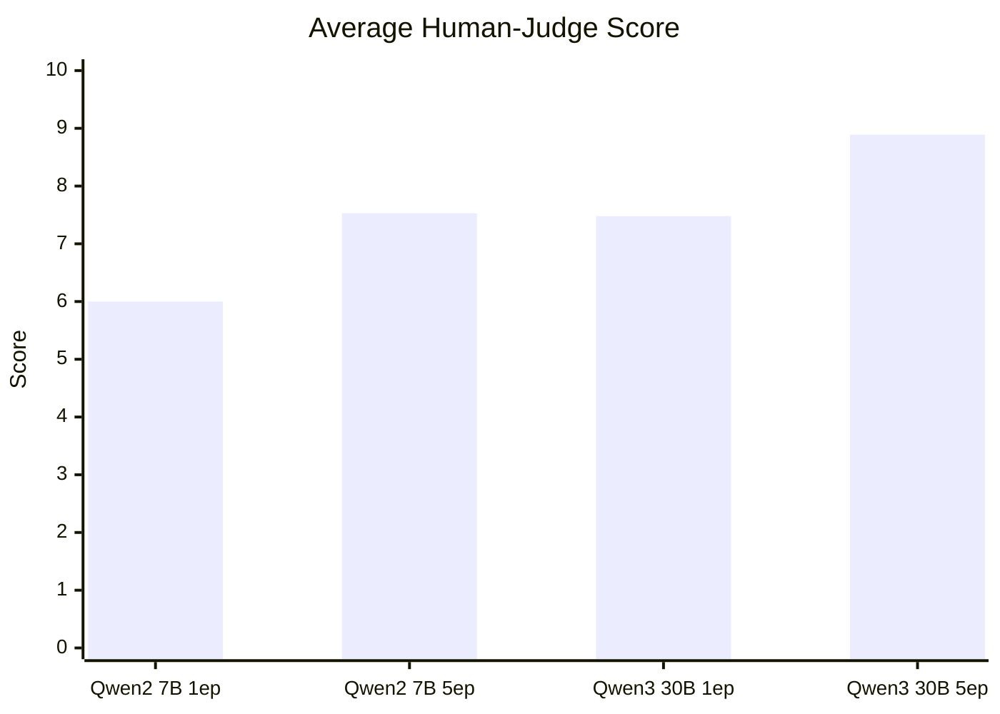
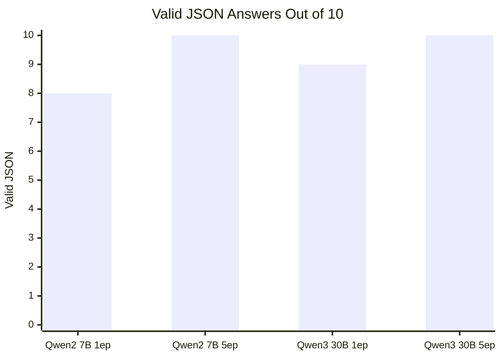
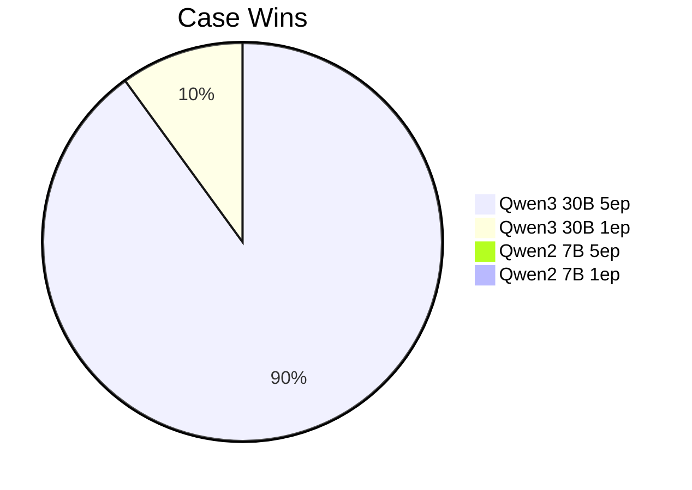

# VIRGIL Fireworks Fine-Tune Eval

Date: 2026-05-17
Judge: frontier model review over saved local outputs
Eval set: 10 held-out VIRGIL cybersecurity prompts
Source outputs: `data/fireworks/inference_evals/fireworks_inference_eval_20260517T060509Z_combined_judge_pairs.jsonl`

## Executive Verdict

The 30B 5-epoch LoRA is the clear winner. It won 9 of 10 cases, produced valid JSON on every prompt, had the best average human-judge score, and was also the fastest of the fine-tuned deployments in this small run.

The Qwen2 7B 5-epoch LoRA is the value champion. It did not beat the 30B 5-epoch model on quality, but it stayed structurally clean at 10/10 valid JSON and produced useful SOC answers at much lower training and inference cost.

The 30B 1-epoch LoRA showed real intelligence but had one severe runaway failure. Its good answers were strong, but the failure mode matters because VIRGIL needs reliable structured output.

The Qwen2 7B 1-epoch LoRA is visibly undertrained. It produced useful material in several cases, but invalid JSON and one max-token cutoff make it unsuitable as the main endpoint investigator.

## Scoreboard

| Model | Avg Judge Score | Case Wins | Valid JSON | Avg Latency | Structural Notes |
|---|---:|---:|---:|---:|---|
| Qwen3 30B A3B LoRA 5ep | **8.89** | **9/10** | **10/10** | **3.84s** | Clean, concise, best technical depth |
| Qwen2 7B LoRA 5ep | 7.53 | 0/10 | **10/10** | 6.20s | Best budget performer |
| Qwen3 30B A3B LoRA 1ep | 7.48 | 1/10 | 9/10 | 5.55s | High ceiling, one runaway |
| Qwen2 7B LoRA 1ep | 6.00 | 0/10 | 8/10 | 7.37s | Undertrained, brittle structure |

## Quality Graphs

### Average Judge Score

### Structural Reliability

### Case Wins

## Per-Case Results

| Case | Topic | Winner | Why |
|---:|---|---|---|
| 1 | PR preview, OAuth app abuse, postinstall execution | Qwen3 30B 5ep | Best linked browser-origin file write, package script abuse, forked PR, and OAuth scopes into a coherent supply-chain/CI hypothesis. |
| 2 | sudoers NOPASSWD with `LD_PRELOAD` kept | Qwen3 30B 5ep | Best explained the runtime privilege path and why an unmodified app binary is not benign evidence. |
| 3 | `rundll32` loading remote unsigned DLL | Qwen3 30B 5ep | Clean proxy-execution and lateral-movement assessment; 30B 1ep failed with repetitive truncation. |
| 4 | Kernel KTIMER/KDPC execution | Qwen3 30B 5ep | Strongest explanation of why no user-mode thread appears and what kernel artifacts to hunt. |
| 5 | Drupal CVE-2018-7600 exploitation | Qwen3 30B 5ep | Best chain: crafted form POST, webshell, payload fetch, admin persistence, and response sequence. |
| 6 | `regini` registry permission tampering | Qwen3 30B 5ep | Best combined parentage, file path, sensitive keys, and missing change context. |
| 7 | Malicious npm package on macOS developer workstation | Qwen3 30B 5ep | Best covered typosquat-style package execution, fork delivery, credential theft, and endpoint/cloud hunts. |
| 8 | Section-backed DLL memory patching | Qwen3 30B 5ep | Best captured duplicate section handle, image-backed hash drift, and no private RX allocation. |
| 9 | Linux archived journal recovery | Qwen3 30B 5ep | Correctly used `journalctl --file` and interpreted `remote/` as journal forwarding context. |
| 10 | IR lifecycle feedback | Qwen3 30B 1ep | Best complete lifecycle answer; 30B 5ep was concise but too case-study-ish and had shaky technique wording. |

## Model Personalities

### Qwen3 30B A3B LoRA 5ep

This model feels like the first real VIRGIL candidate. It is direct, structured, and technically specific. It does not just name a technique; it explains why benign alternatives fail. Its strongest moments came in kernel/DPC reasoning, section-backed injection, and Linux journal recovery.

Weak spot: it can be too concise on broad process questions. In case 10, the 1-epoch 30B answer gave a richer incident-response lifecycle answer.

### Qwen2 7B LoRA 5ep

This is the budget surprise. It is not as sharp as the 30B 5ep model, but it is disciplined. It keeps the requested XML-like tags, emits valid JSON, and usually gives actionable hunts.

Weak spot: deeper platform semantics. The Linux journal case exposed a real conceptual miss: it treated `remote/` as attacker staging rather than systemd journal forwarding context.

### Qwen3 30B A3B LoRA 1ep

The 1-epoch 30B run shows why model size matters: several answers were better than the 7B 5ep run despite less training. But it also had the worst single failure of the eval: a runaway repetitive response that never closed the tags.

Weak spot: reliability. This model needs either more epochs, stricter decoding, or output constraints before production use.

### Qwen2 7B LoRA 1ep

The 1-epoch 7B run learned the broad VIRGIL shape but not enough discipline. It sometimes lands the main idea, then fails the JSON contract or spirals into source-metadata repetition.

Weak spot: structured answer reliability and precision. It is useful as a training baseline, not as the deployable endpoint.

## Cost/Quality Read

Training-loss metrics predicted most of what we saw:

| Model | Final Eval Loss | Inference Eval Result |
|---|---:|---|
| Qwen2 7B 1ep | 1.8418 | Weakest structure and quality |
| Qwen3 30B 1ep | 1.5479 | Smart but one catastrophic runaway |
| Qwen2 7B 5ep | 1.4570 | Stable and practical |
| Qwen3 30B 5ep | about 1.21 mid-run | Best by a wide margin |

The lesson is not “always buy the bigger model.” The lesson is:

1. One epoch is not enough for this response contract.
2. Five epochs turned 7B from shaky into useful.
3. Five epochs on 30B produced the first model that actually feels like VIRGIL.
4. Loss is useful, but structural evals catch failures that loss can hide.

## Recommendation

Use Qwen3 30B A3B LoRA 5ep as the quality target and Qwen2 7B LoRA 5ep as the cost target.

For the next round:

1. Run a base-model comparison against the same 10 cases.
2. Run a larger 50-case eval on Qwen3 30B 5ep and Qwen2 7B 5ep.
3. Add an automated judge that scores structure, JSON, MITRE quality, missing benign evidence, hypotheses, and actionability.
4. Try lower `max_tokens` or stronger stop rules for the 1-epoch models to quantify how much of their failure is decoding versus training.

## Artifact Index

| Artifact | Path |
|---|---|
| Combined candidate outputs | `data/fireworks/inference_evals/fireworks_inference_eval_20260517T060509Z_combined_judge_pairs.jsonl` |
| Human judgment JSON | `data/fireworks/inference_evals/fireworks_inference_eval_20260517T060509Z_human_judgment.json` |
| 30B pair output summary | `data/fireworks/inference_evals/fireworks_inference_eval_20260517T055905Z_summary.json` |
| Qwen2 7B 5ep output summary | `data/fireworks/inference_evals/fireworks_inference_eval_20260517T060247Z_summary.json` |
| Qwen2 7B 1ep output summary | `data/fireworks/inference_evals/fireworks_inference_eval_20260517T060509Z_summary.json` |
